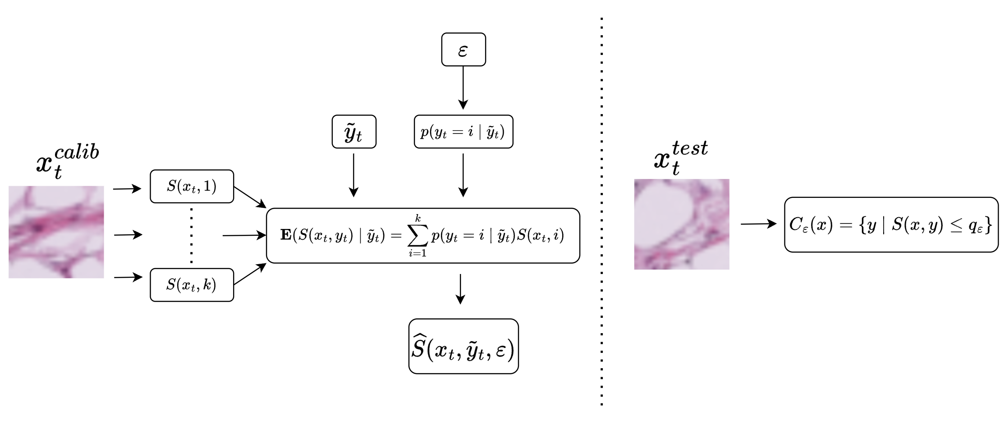
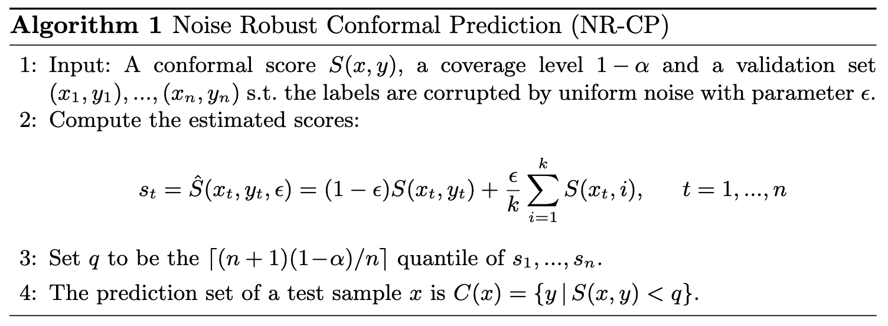

# Noise-Robust-Conformal-Prediction
Code release for "A Conformal Prediction Score which is Robust to Label Noise"

## Framework

## Algorithm Box

## Repository Structure
1. `HPS.py`, `APS.py`, `RAPS.py` - original methods for conformal prediction
2. `NoiseRobustHPS.py`, `NoiseRobustAPS.py`, `NoiseRobustRAPS.py` - Noise Robust Conformal Prediction Framework applied to known scores.
